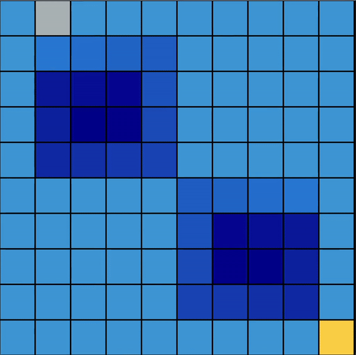
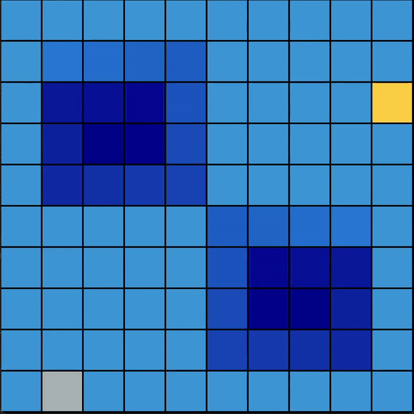
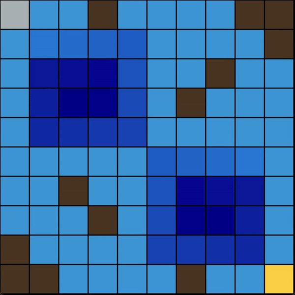
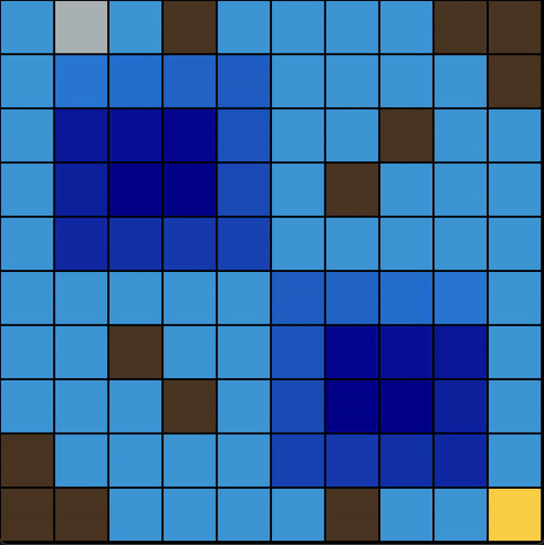
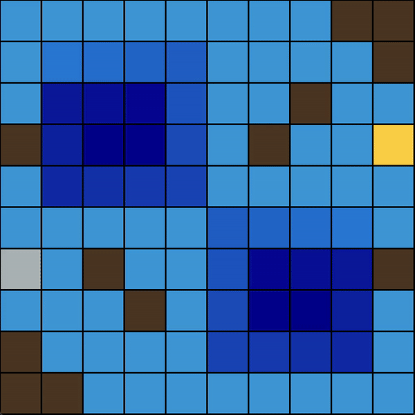

# AI_Stormy Sea Custom Environment using Q-Learning

## Overview

This project implements a custom environment for reinforcement learning using Q-Learning. The environment consists of various configurations, including easy and hard settings, with both randomized and static elements. The primary goal is to train an agent to navigate through a maze, avoid obstacles, and reach a goal successfully.

## Repository Structure

- **check_env/**: Contains scripts for environment structure validation and testing. 
- **gifs/**: Directory with GIFs showcasing the agent's performance in various environments.
- **models/**: Directory where pre-trained models at a certain epoch are saved.
- **plots/**: Directory containing plots and graphs related to training results and evaluations.
- **stats**: Contains statistical data files, such as training logs and performance metrics over epochs.
- **MANFRELLOTTI_AI_models_Project.pdf**: Comprehensive report detailing the project, methodology, and results.
- **env_QL.py**: Script defining the Q-Learning algorithm employed, training and testing process. 
- **make_plots.py**: Contains functions for generating plots and visualizations of training results.
- **sea_env.py**: Script defining the custom sea environment, including state, actions, rewards, and rendering logic.
- **vortices.py**: Includes functions for handling vortices within the environment.

## Environment Description

The environment is a grid-based maze where the agent must navigate through a stormy sea across various possible scenarios, including obstacles, currents, vortices and facing randomness. The following configurations are available:

- **Easy Environment**: 
  - A basic setup with static positions for both the agent and the goal. This simple configuration serves as an initial benchmark for evaluating the agent's basic movement and goal-reaching capabilities.

- **Randomized Easy Environment**: 
  - Similar to the Easy Environment but with randomized starting positions for both the agent and the goal. This configuration tests the agent's adaptability to different initial conditions.

- **Hard Environment**: 
  - Includes static obstacles (rocks) that the agent must avoid while navigating to the goal. This setup increases the complexity by adding obstacles that require more sophisticated navigation strategies.

- **Randomized Hard Environment**: 
  - Builds on the Hard Environment by also randomizing the positions of some rocks based on fixed patterns. This setup introduces greater variability and tests the agent's ability to handle dynamic obstacles.

- **Randomized Hard Environment with Random Agent and Goal**: 
  - The most complex configuration, featuring full randomization of the obstacles and the positions of the agent and goal. This environment challenges the agent with the highest level of variability, requiring robust decision-making under uncertainty.

---
## Results
You can see the complete training results in the plots directory. 
Also you can read the [report](MANFRELLOTTI_AI_models_Project.pdf) with a detailed overview of the project.  

### GiFs!!
Here you can see how the agents solve all the environment configurations in this project.  

- **Easy Environment**:
 -  

- **Randomized Easy Environment**:
 - 

- **Hard Environment**:
 -  

- **Randomized Hard Environment**:
 - 

- **Randomized Hard randomized Environment**:
 -  

## Sources that helped me and other interesting materials
[How to build a gym custom environment tutorial]([https://www.youtube.com/watch?v=5P7I-xPq8u8](https://www.gymlibrary.dev/content/environment_creation/))  
[Q-Learning applied on a custom gym environment tutorial]([https://www.youtube.com/watch?v=H1NRNGiS8YU&t=2342s](https://www.youtube.com/watch?v=AoGRjPt-vms)) 
